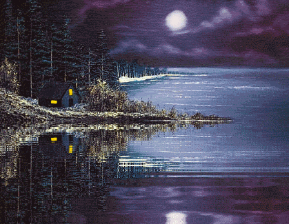

<h3 align="center">
  سلام
  , من robonamari هستم
</h1>

  

|                          💻 برنامه نویسی                          |                              🔎 دیگر                              |                                       🧰 استفاده از ابزار های                                       |
| :---------------------------------------------------------------: | :---------------------------------------------------------------: | :-------------------------------------------------------------------------------------------------: |
|  |  |  |

